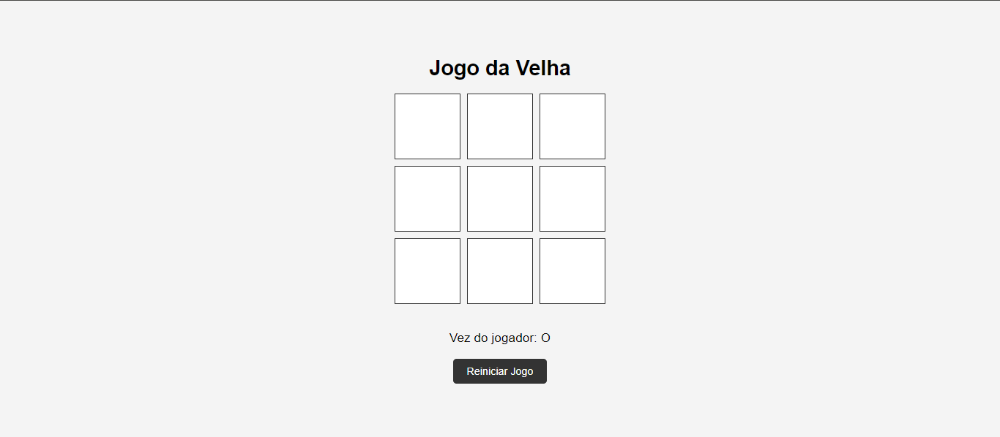

# Jogo da Velha (Tic-Tac-Toe)

Este é um simples jogo da velha (tic-tac-toe) implementado com **HTML**, **CSS** e **JavaScript**. O jogador humano joga contra a máquina (computador), e as jogadas se alternam automaticamente.

## Como funciona

- O jogador começa primeiro e joga com o símbolo **"O"**.
- A jogada da máquina é automática e ocorre logo após a jogada do jogador. A máquina joga com o símbolo **"X"**.
- O jogo continua até que haja um vencedor (linha, coluna ou diagonal preenchida com o mesmo símbolo) ou até que todas as células estejam preenchidas (empate).

## Regras

- O jogo segue as regras padrão do jogo da velha:
  - Dois jogadores se alternam colocando seus símbolos (O e X) em uma grade 3x3.
  - O objetivo é preencher uma linha, coluna ou diagonal com o mesmo símbolo.
  - Se todas as células forem preenchidas sem um vencedor, o jogo termina em empate.

## Captura de tela



### Jogue clicando no link abaixo:

([jogo-velha-coral.vercel.app](https://jogo-velha-coral.vercel.app)).

1. Faça o download ou clone este repositório:
   ```bash
   git clone https://github.com/ronnysenna/jogo-velha


